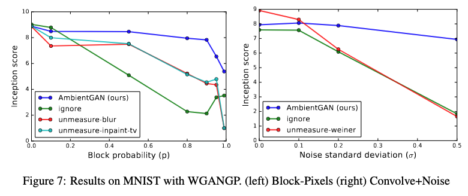

# ambient-gan
Implementation of the AmbientGAN model as a final project for UCLA's Stat 231B course. 

We will reproduce Figure 7. This requires implementing a Wasserstein GAN with gradient penalty (WGANGP) with the Block-Pixels and Convolve+Noise measurement models. 

The AmbientGAN model is benchmarked against alternatives:
- For Block-Pixels:
    1. Ignore: learn the model directly on the measurements
    2. Unmeasure-blur: invert measurement function through blurring to fill zeros
    3. Unmeasure-inpaint-tv: invert through total variation inpainting
- For Convolve+Noise:
    1. Ignore
    2. Unmeasure-weiner: invert through Wiener deconvolution

 

Three models must be trained:
1. Generator: generates samples from $p_x$
2. Discriminator
3. Inception model: obtains conditional label distribution $p(y|\bm x)$

The Generator and Discriminator must be trained for each block probability p or noise sd \sigma. The inception model must be only trained once, and the inception score is used to calcuate the inception score:

$$IS = \exp\left(\mathbb{E}_{x}\left[KL\left(p(y|x) \ | \ p(y)\right)\right]\right)$$

Implementation of the models will build on the code contained from the following sources:
- https://github.com/igul222/improved_wgan_training (WGANGP)
- https://github.com/AshishBora/ambient-gan/blob/master/src/mnist/gen/gan_def.py
- https://docs.pytorch.org/tutorials/beginner/dcgan_faces_tutorial.html
- https://github.com/Zeleni9/pytorch-wgan/blob/master/models/wgan_gradient_penalty.py

"The WGANGP model on MNIST follows the architecture in [Gulrajani et al. (2017)]. The generator takes in a latent vector of 128 dimensions where each coordinate is sampled IID Uniform on [−1, 1]. The generator then applies one linear and three deconvolutional layers. The discriminator uses three convolutional layers followed by one linear layer. Batch-norm is not used." - Page 16

Source: 
- Bora, A., Price, E., & Dimakis, A. G. (2018, February). AmbientGAN: Generative models from lossy measurements. In International conference on learning representations.
- Tim Salimans, Ian Goodfellow, Wojciech Zaremba, Vicki Cheung, Alec Radford, and Xi Chen. Improved techniques for training gans. In Advances in Neural Information Processing Systems, pp. 2234–2242, 2016.
